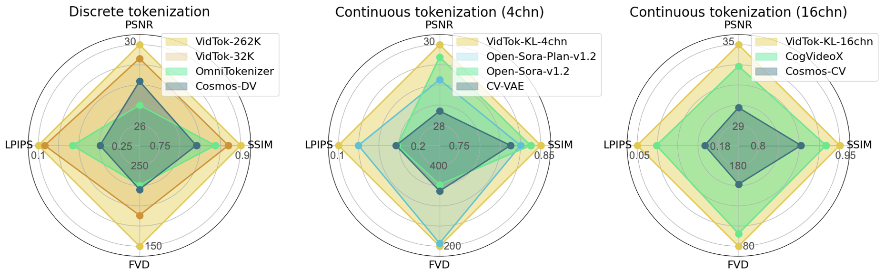

<div align="center">

# VidTok <br> <sub>A Family of Versatile and State-Of-The-Art Video Tokenizers</sub>

[](https://arxiv.org/pdf/2412.13061) &ensp; [](https://github.com/microsoft/VidTok) &ensp; [](https://huggingface.co/microsoft/VidTok)
</div>

---



 We introduce VidTok, a cutting-edge family of video tokenizers that excels in both continuous and discrete tokenizations. VidTok incorporates several key advancements over existing approaches:
 * ⚡️ **Efficient Architecture**. Separate spatial and temporal sampling reduces computational complexity without sacrificing quality.
 * 🔥 **Advanced Quantization**. Finite Scalar Quantization (FSQ) addresses training instability and codebook collapse in discrete tokenization.
 * 💥 **Enhanced Training**. A two-stage strategy—pre-training on low-res videos and fine-tuning on high-res—boosts efficiency. Reduced frame rates improve motion dynamics representation.

VidTok, trained on a large-scale video dataset, outperforms previous models across all metrics, including PSNR, SSIM, LPIPS, and FVD.

https://github.com/user-attachments/assets/a3341037-130d-4a83-aba6-c3daeaf66932

## News

* December, 2024: 🚀 [VidTok](https://github.com/microsoft/vidtok) was released!

## Setup
1. Clone this repository and navigate to VidTok folder:
```
git clone https://github.com/microsoft/VidTok
cd VidTok
```
2. We provide an `environment.yaml` file for setting up a Conda environment. Conda's installation instructions are available [here](https://docs.anaconda.com/miniconda/index.html).
```bash
# 1. Prepare conda environment
conda env create -f environment.yaml
# 2. Activate the environment
conda activate vidtok
```

## Checkpoints
Download pre-trained models [here](https://huggingface.co/microsoft/VidTok/tree/main/checkpoints), and put them in `checkpoints` folder, like:
```
└── checkpoints
    ├── vidtok_fsq_causal_41616_262144.ckpt
    ├── vidtok_fsq_causal_488_262144.ckpt
    ├── vidtok_fsq_causal_488_32768.ckpt
    ├── vidtok_fsq_causal_488_4096.ckpt
    ├── vidtok_fsq_noncausal_41616_262144.ckpt
    ├── vidtok_fsq_noncausal_488_262144.ckpt
    ├── vidtok_kl_causal_41616_4chn.ckpt
    ├── vidtok_kl_causal_488_16chn.ckpt
    ├── vidtok_kl_causal_488_8chn.ckpt
    ├── vidtok_kl_causal_488_4chn.ckpt
    ├── vidtok_kl_noncausal_41616_4chn.ckpt
    └── vidtok_kl_noncausal_488_4chn.ckpt
```
Each checkpoint has a corresponding config file with the same name in `configs` folder.
| Model  | Regularizer | Causal  | VCR  | PSNR  | SSIM  | LPIPS  | FVD |
|------|------|------|------|------|------|------|------|
| [vidtok_kl_causal_488_4chn](https://huggingface.co/microsoft/VidTok/blob/main/checkpoints/vidtok_kl_causal_488_4chn.ckpt)  | KL-4chn  | ✔️   | 4x8x8  | 29.64 | 0.852| 0.114| 194.2|
| [vidtok_kl_causal_488_8chn](https://huggingface.co/microsoft/VidTok/blob/main/checkpoints/vidtok_kl_causal_488_8chn.ckpt)  |  KL-8chn |  ✔️   |4x8x8  | 31.83 | 0.897| 0.083| 109.3|
| [vidtok_kl_causal_488_16chn](https://huggingface.co/microsoft/VidTok/blob/main/checkpoints/vidtok_kl_causal_488_16chn.ckpt)  | KL-16chn  | ✔️  | 4x8x8   | 35.04 |0.942 |0.047 | 78.9| 
| [vidtok_kl_causal_41616_4chn](https://huggingface.co/microsoft/VidTok/blob/main/checkpoints/vidtok_kl_causal_41616_4chn.ckpt)  | KL-4chn  | ✔️  | 4x16x16   | 25.05  | 0.711| 0.228| 549.1| |
| [vidtok_kl_noncausal_488_4chn](https://huggingface.co/microsoft/VidTok/blob/main/checkpoints/vidtok_kl_noncausal_488_4chn.ckpt)  | KL-4chn  |  ✖️ | 4x8x8   | 30.60  | 0.876 | 0.098| 157.9| 
| [vidtok_kl_noncausal_41616_4chn](https://huggingface.co/microsoft/VidTok/blob/main/checkpoints/vidtok_kl_noncausal_41616_4chn.ckpt)  |  KL-4chn | ✖️  | 4x16x16   | 26.06  | 0.751 | 0.190|423.2 |
| [vidtok_fsq_causal_488_262144](https://huggingface.co/microsoft/VidTok/blob/main/checkpoints/vidtok_fsq_causal_488_262144.ckpt)  | FSQ-262,144  | ✔️  |  4x8x8  | 29.82  | 0.867 |0.106 | 160.1|
| [vidtok_fsq_causal_488_32768](https://huggingface.co/microsoft/VidTok/blob/main/checkpoints/vidtok_fsq_causal_488_32768.ckpt)  | FSQ-32,768  | ✔️  | 4x8x8   | 29.16  | 0.854 | 0.117| 196.9|
| [vidtok_fsq_causal_488_4096](https://huggingface.co/microsoft/VidTok/blob/main/checkpoints/vidtok_fsq_causal_488_4096.ckpt)  | FSQ-4096  | ✔️  | 4x8x8   | 28.36 | 0.832 | 0.133| 218.1|
| [vidtok_fsq_causal_41616_262144](https://huggingface.co/microsoft/VidTok/blob/main/checkpoints/vidtok_fsq_causal_41616_262144.ckpt)  |  FSQ-262,144 |  ✔️ |  4x16x16 | 25.38 | 0.738 |0.206 | 430.1|
| [vidtok_fsq_noncausal_488_262144](https://huggingface.co/microsoft/VidTok/blob/main/checkpoints/vidtok_fsq_noncausal_488_262144.ckpt)  |  FSQ-262,144 | ✖️  | 4x8x8 | 30.78 | 0.889| 0.091| 132.1|
| [vidtok_fsq_noncausal_41616_262144](https://huggingface.co/microsoft/VidTok/blob/main/checkpoints/vidtok_fsq_noncausal_41616_262144.ckpt)  |  FSQ-262,144 | ✖️  |  4x16x16  | 26.37 | 0.772| 0.171| 357.0|

- `VCR` indicates the video compression ratio `TxHxW`.
- The above table shows model performance evaluated on 30 test videos in [MCL_JCL](https://mcl.usc.edu/mcl-jcv-dataset/) dataset, with a sample fps of 30. The input size is `17x256x256` for causal models and `16x256x256` for non-causal models.


## Training

### Data Preparation
1. Put all training videos under `DATA_DIR`:
```
└── DATA_DIR
    ├── subset1
    │   ├── videoname11.mp4
    │   └── videoname12.mp4
    ├── subset2
    │   ├── videoname21.mp4
    │   ├── videoname22.mp4
    │   └── subsubset1
    │       ├── videoname211.mp4
    │       └── videoname212.mp4
    └── ...
```
2. Prepare a `.csv` meta file to record the relative paths of these videos with respect to `DATA_DIR`, like:
```
videos
subset1/videoname11.mp4
subset2/videoname21.mp4
subset2/subsubset1/videoname211.mp4
```

> Validation data is also prepared following the above steps.

### Fine-tune on Custom Data
1. Prepare your own training and validation data following [Data Preparation](#data-preparation).
2. Select the appropriate `CONFIG` file from `configs` folder based on your needs, and modify the following parameters:
  - Specify the `ckpt_path` parameter to initialize the model with pre-trained checkpoint parameters:
  ```yaml
  model:
    params:
      ckpt_path: PATH_TO_CHECKPOINT  # train from existing checkpoint
  ```
  - Specify the `data` section to use your own training and validation data:
  ```yaml
    train:
        target: vidtok.data.vidtok.VidTokDataset
        params:
          data_dir: DATA_DIR_1  # DATA_DIR for training data
          meta_path: META_PATH_1  # path to the .csv meta file of training data
          video_params:
            input_height: INPUT_HEIGHT_1
            input_width: INPUT_WIDTH_1
            sample_num_frames: NUM_FRAMES_1  # typically set to 17 for causal models and 16 for non-causal models
            sample_fps: SAMPLE_FPS_1  # sample fps for training data
    validation:
        target: vidtok.data.vidtok.VidTokDataset
        params:
          data_dir: DATA_DIR_2  # DATA_DIR for validation data
          meta_path: META_PATH_2  # path to the .csv meta file of validation data
          video_params: 
            input_height: INPUT_HEIGHT_2
            input_width: INPUT_WIDTH_2
            sample_num_frames: NUM_FRAMES_2  # typically set to 17 for causal models and 16 for non-causal models
            sample_fps: SAMPLE_FPS_2  # sample fps for validation data
          start_index: 0  # fixed value to ensure the same sampled data
  ```
  - Set `fix_encoder` and `fix_decoder` to be `False` to enable full model fine-tuning:
  ```yaml
  model:
    params:
      encoder_config:
        params:
          fix_encoder: false
          fix_decoder: false
  ```
  - Other hyperparameters according to your needs.

3. Run the following command to start training:
```bash
python main.py -b CONFIG --logdir LOGDIR

# You can also use `torchrun` to start the training code.
```
Training logs and checkpoints are saved in `LOGDIR`. 

It is recommended to use [Weights & Biases](https://wandb.ai/site) as the data visualization tool ([TensorBoard](https://www.tensorflow.org/tensorboard) by default). Use `wandb login` to log in first, and then run:
```
python main.py -b CONFIG --logdir LOGDIR --wandb --wandb_entity ENTITY --wandb_project PROJECT
```


### Train from Scratch
<details>
<summary>Two-stage Training</summary>
We adopt a two-stage training strategy to improve training efficiency: initially pre-training the full model on low-resolution videos, followed by fine-tuning only the decoder on high-resolution videos.

| First Stage  | Second Stage | Fix encoder   | PSNR  | SSIM  | LPIPS  | GPU Hours|
|------|------|------|------|------|------|------|
| 256 x 256  | -  | - | 29.19  | 0.843 | 0.127| 3,072|
| 128 x 128  | 256 x 256  | ✔️ | 29.21  | 0.843 | 0.125| 1,536|

1. Prepare your own training and validation data following [Data Preparation](#data-preparation).
2. Select the appropriate `CONFIG` file from `configs` folder based on your needs, and specify the `data` section to use your own training and validation data:
  ```yaml
    train:
        target: vidtok.data.vidtok.VidTokDataset
        params:
          data_dir: DATA_DIR_1  # DATA_DIR for training data
          meta_path: META_PATH_1  # path to the .csv meta file of training data
          video_params:
            input_height: INPUT_HEIGHT_1  # vary in different training stages
            input_width: INPUT_WIDTH_1  # vary in different training stages
            sample_num_frames: NUM_FRAMES_1  # typically set to 17 for causal models and 16 for non-causal models
            sample_fps: SAMPLE_FPS_1  # sample fps for training data
    validation:
        target: vidtok.data.vidtok.VidTokDataset
        params:
          data_dir: DATA_DIR_2  # DATA_DIR for validation data
          meta_path: META_PATH_2  # path to the .csv meta file of validation data
          video_params: 
            input_height: INPUT_HEIGHT_2
            input_width: INPUT_WIDTH_2
            sample_num_frames: NUM_FRAMES_2  # typically set to 17 for causal models and 16 for non-causal models
            sample_fps: SAMPLE_FPS_2  # sample fps for validation data
          start_index: 0  # fixed value to ensure the same sampled data
  ```

3. Start the first stage of training. First, revise the `CONFIG` file to enable full model training with low-resolution data:
```yaml
model:
  params:
    # ckpt_path:  # disable this parameter so as to train from scratch
    encoder_config:
      params:
        fix_encoder: false
        fix_decoder: false
data:
  params:
    train:
      params:
        video_params:
            input_height: 128
            input_width: 128
```
Then revise other hyperparameters according to your needs, and run the training command to start training as in [Fine-tune on Custom Data](#fine-tune-on-custom-data). We train VidTok for 50,000 steps with batch size 16 in this stage.

4. Start the second stage of training. First, revise the `CONFIG` file to enable the fine-tuning of the decoder with high-resolution data:
```yaml
model:
  params:
    ckpt_path: CKPT_PATH  # path to the saved checkpoint after the first stage of training
    encoder_config:
      params:
        fix_encoder: true
        fix_decoder: false
data:
  params:
    train:
      params:
        video_params:
            input_height: 256
            input_width: 256
```
Then revise other hyperparameters according to your needs, and run the training command to start training as in [Fine-tune on Custom Data](#fine-tune-on-custom-data). We train VidTok for 30,000 steps with batch size 8 in this stage.
</details>


## Inference

### Easy Usage
We provide the following example for a quick usage of our models. It works for both continuous and discrete tokenization and both causal and non-causal models. 
Just provide the path to the configuration file `cfg_path` and checkpoint file `ckpt_path`, and set `is_causal` to `True` or `False` accordingly.
```python
import torch
from scripts.inference_evaluate import load_model_from_config

cfg_path = "configs/vidtok_kl_causal_488_4chn.yaml"
ckpt_path = "checkpoints/vidtok_kl_causal_488_4chn.ckpt"
is_causal = True

device = torch.device("cuda") if torch.cuda.is_available() else torch.device("cpu")    
# load pre-trained model
model = load_model_from_config(cfg_path, ckpt_path)
model.to(device).eval()
# random input
num_frames = 17 if is_causal else 16
x_input = (torch.rand(1, 3, num_frames, 256, 256) * 2 - 1).to(device)  # [B, C, T, H, W], range -1~1
# model forward
_, x_recon, _ = model(x_input)
assert x_input.shape == x_recon.shape
```

### Reconstruct an Input Video
```
python scripts/inference_reconstruct.py --config CONFIG --ckpt CKPT --input_video_path VIDEO_PATH --num_frames_per_batch NUM_FRAMES_PER_BATCH --input_height 256 --input_width 256 --sample_fps 30 --output_video_dir OUTPUT_DIR
```
- Specify `VIDEO_PATH` to the path of your test video. We provide an example video in `assets/example.mp4`. 
- Set `NUM_FRAMES_PER_BATCH` to `17` for causal models and `16` for non-causal models.
- The reconstructed video is saved in `OUTPUT_DIR`.
- For causal models, you can choose to add `--pad_gen_frames` to the command line, which may improve the smoothness of the reconstructed video.

### Performance Evaluation
We also provide a manuscript `scripts/inference_evaluate.py` to evaluate the video reconstruction performance in PSNR, SSIM and LPIPS.

1. Put all of your test videos under `DATA_DIR`.
2. Run the following command, and all `.mp4` videos under `DATA_DIR` will be tested:
```
python scripts/inference_evaluate.py --config CONFIG --ckpt CKPT --data_dir DATA_DIR --num_frames_per_batch NUM_FRAMES_PER_BATCH --input_height 256 --input_width 256 --sample_fps 30
```
(Optional) If you only want to test certain videos under `DATA_DIR`, you need to prepare a `.csv` meta file 
to indicate the video files to be tested (refer to [Data Preparation](#data-preparation)). And add `--meta_path META_PATH` to the above command to specify the path to the `.csv` meta file.

## Intended Uses

We are sharing our model with the research community to foster further research in this area: 
* Training your own video tokenizers for research purpose.
* Video tokenization with various compression rates.


## Out-of-scope Uses

Our models are not specifically designed or evaluated for all downstream purposes. Developers should consider common limitations of video tokenizers (e.g., performance degradation on out-of-domain data) as they select use cases, and evaluate and mitigate for privacy, safety, and fairness before using within a specific downstream use case, particularly for high-risk scenarios. 

Developers should be aware of and adhere to applicable laws or regulations (including privacy, trade compliance laws, etc.) that are relevant to their use case. 


## Risks and Limitations 

Some of the limitations of this model to be aware of include:
* VidTok may lose detailed information on the reconstructed content.
* VidTok inherits any biases, errors, or omissions characteristic of its training data.
* VidTok was developed for research and experimental purposes. Further testing and validation are needed before considering its application in commercial or real-world scenarios.


## Acknowledgments

This codebase borrows code from [generative-models](https://github.com/Stability-AI/generative-models). We thank Stability AI for its efforts and innovations, which have made the development process more efficient and convenient.

Thank you to everyone who contributed their wisdom and efforts to this project.

## BibTeX

```bibtex
@article{tang2024vidtok,
  title={VidTok: A Versatile and Open-Source Video Tokenizer},
  author={Tang, Anni and He, Tianyu and Guo, Junliang and Cheng, Xinle and Song, Li and Bian, Jiang},
  year={2024},
  journal={arXiv preprint arXiv:2412.13061},
}
```

## Contact

We welcome feedback and collaboration from our audience. If you have suggestions, questions, or observe unexpected/offensive behavior in our technology, please contact us at tianyuhe@microsoft.com.

## Contributing

This project welcomes contributions and suggestions.  Most contributions require you to agree to a
Contributor License Agreement (CLA) declaring that you have the right to, and actually do, grant us
the rights to use your contribution. For details, visit https://cla.opensource.microsoft.com.

When you submit a pull request, a CLA bot will automatically determine whether you need to provide
a CLA and decorate the PR appropriately (e.g., status check, comment). Simply follow the instructions
provided by the bot. You will only need to do this once across all repos using our CLA.

This project has adopted the [Microsoft Open Source Code of Conduct](https://opensource.microsoft.com/codeofconduct/).
For more information see the [Code of Conduct FAQ](https://opensource.microsoft.com/codeofconduct/faq/) or
contact [opencode@microsoft.com](mailto:opencode@microsoft.com) with any additional questions or comments.


## Trademarks

This project may contain trademarks or logos for projects, products, or services. Authorized use of Microsoft 
trademarks or logos is subject to and must follow 
[Microsoft's Trademark & Brand Guidelines](https://www.microsoft.com/en-us/legal/intellectualproperty/trademarks/usage/general).
Use of Microsoft trademarks or logos in modified versions of this project must not cause confusion or imply Microsoft sponsorship.
Any use of third-party trademarks or logos are subject to those third-party's policies.
