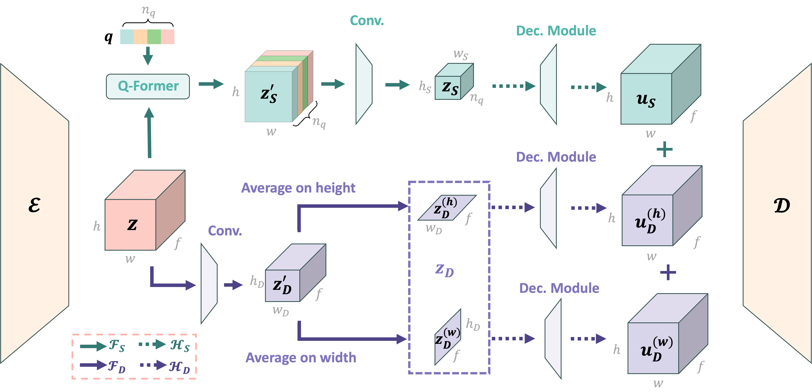

<h1 align="center">
 VidTwin: Video VAE with Decoupled Structure and Dynamics
</h1>
<h3 align="center">
  <a href="https://wangyuchi369.github.io/">Yuchi Wang</a> &nbsp; 
  <a href="https://lemmonation.github.io/">Junliang Guo</a> &nbsp;
  <a href="https://ieeexplore.ieee.org/author/37088736490">Xinyi Xie</a> &nbsp;
  <a href="https://www.microsoft.com/en-us/research/people/tianyuhe/">Tianyu He</a> &nbsp;
  <a href="https://xusun26.github.io/">Xu Sun</a> &nbsp;
  <a href="https://sites.google.com/view/jiangbian">Jiang Bian</a>
</h3>

<br>

<div align=center>

[](https://arxiv.org/pdf/2412.17726) &ensp; [](https://github.com/microsoft/VidTok) &ensp; [](https://wangyuchi369.github.io/VidTwin/)

<h3> 🔥 Check our <a href="https://wangyuchi369.github.io/VidTwin/">Demo Page</a> for enhanced visual experience.</h3>


<br>
<br>
</div>

We propose a novel and compact video autoencoder, VidTwin, that decouples video into two distinct latent spaces: **Structure latent vectors**, which capture overall content and global movement, and **Dynamics latent vectors**, which represent fine-grained details and rapid movements. 

Extensive experiments show that VidTwin achieves a high compression rate of 0.20% with high reconstruction quality (PSNR of 28.14 on the MCL-JCV dataset), and performs efficiently and effectively in downstream generative tasks. Moreover, our model demonstrates explainability and scalability, paving the way for future research in video latent representation and generation.
<div align=center>
  <br>

</div>

## Setup

1. Our code is based on **VidTok**, so you will need to install the [required packages for VidTok](https://github.com/microsoft/VidTok?tab=readme-ov-file#setup) first. To do so, navigate to the VidTok folder and create the environment using the `environment.yaml` file:

```bash
cd VidTok
# Prepare conda environment
conda env create -f environment.yaml
# Activate the environment
conda activate vidtok
```

2. After setting up VidTok, install the additional packages required for the VidTwin model:
```bash
pip install tranformers
pip install timm
pip install flash-attn --no-build-isolation
```


## Training

### Data Preparation

We follow the same approach as **VidTok** to prepare the data. You can also find the Dataloader class in: `vidtok/data/vidtok.py`. This Dataloader is a general-purpose class for handling video data. You may customize it to suit your own dataset and specific use cases.

1. Put all training videos under `DATA_DIR`:
```
└── DATA_DIR
    ├── subset1
    │   ├── videoname11.mp4
    │   └── videoname12.mp4
    ├── subset2
    │   ├── videoname21.mp4
    │   ├── videoname22.mp4
    │   └── subsubset1
    │       ├── videoname211.mp4
    │       └── videoname212.mp4
    └── ...
```
2. Prepare a `.csv` meta file to record the relative paths of these videos with respect to `DATA_DIR`, like:
```
videos
subset1/videoname11.mp4
subset2/videoname21.mp4
subset2/subsubset1/videoname211.mp4
```

> Validation data is also prepared following the above steps.

### Launch Training

1. Specify the Configuration File

Our code follows a **modular design**, allowing you to easily customize the model structure and training settings by modifying a configuration file. For the **VidTwin** model, we provide the following configuration file:`configs/vidtwin/vidtwin_structure_7_7_8_dynamics_7_8.yaml`.

- In the **Model** section of the configuration file, you can specify the model's structure and key hyperparameters. For instance, you can adjust the following settings:

```yaml
model:
  params:
    expect_ch: 8  # the dimension of the Structure Latent, d_S
    cont_num_blocks: 1 # downsample blocks of the Structure Latent, 1 -> h_S = 7, 2 -> h_S = 4, 3 -> h_S = 2
    downsample_motion: True
    motion_num_blocks: 1 # downsample blocks of the Dynamics Latent, 1 -> h_D = 7, 2 -> h_D = 4, 3 -> h_D = 2
    d_dim: 8 # the dimension of the Dynamics Latent, d_D
```

- If you'd like to **fine-tune** the model from a pre-trained checkpoint instead of training from scratch, you can specify the `ckpt_path` parameter in the configuration file. 

```yaml
model:
  params:
    ckpt_path: PATH_TO_CHECKPOINT  # train from existing checkpoint
```

- In the **Data** section of the configuration file, you can specify paths and other important data-related hyperparameters. 

```yaml
train:
    target: vidtok.data.vidtok.VidTokDataset
    params:
      data_dir: DATA_DIR_1  # DATA_DIR for training data
      meta_path: META_PATH_1  # path to the .csv meta file of training data
      video_params:
        input_height: INPUT_HEIGHT_1 # 224 for our VidTwin model
        input_width: INPUT_WIDTH_1 # 224 for our VidTwin model
        sample_num_frames: NUM_FRAMES_1  # set to 16 for our VidTwin model
        sample_fps: SAMPLE_FPS_1  # sample fps for training data, 8 for VidTwin model
validation:
    target: vidtok.data.vidtok.VidTokDataset
    params:
      data_dir: DATA_DIR_2  # DATA_DIR for validation data
      meta_path: META_PATH_2  # path to the .csv meta file of validation data
      video_params: 
        input_height: INPUT_HEIGHT_2 # 224 for our VidTwin model
        input_width: INPUT_WIDTH_2 # 224 for our VidTwin model
        sample_num_frames: NUM_FRAMES_2  # set to 16 for our VidTwin model
        sample_fps: SAMPLE_FPS_2  # sample fps for validation data
      start_index: 0  # fixed value to ensure the same sampled data
```

2. Run the following command to start training:
```bash
python main.py -b CONFIG --logdir LOGDIR

# You can also use `torchrun` to start the training code.
```
Training logs and checkpoints are saved in `LOGDIR`. 

It is recommended to use [Weights & Biases](https://wandb.ai/site) as the data visualization tool ([TensorBoard](https://www.tensorflow.org/tensorboard) by default). Use `wandb login` to log in first, and then run:
```
python main.py -b CONFIG --logdir LOGDIR --wandb --wandb_entity ENTITY --wandb_project PROJECT
```

## Inference


### Easy Usage
We provide the following example for a quick usage of our models. 
Just provide the path to the configuration file `cfg_path` and checkpoint file `ckpt_path`.
```python
import torch
from scripts.inference_evaluate import load_model_from_config

cfg_path = "configs/vidtwin/vidtwin_structure_7_7_8_dynamics_7_8.yaml"
ckpt_path = "checkpoints/vidtwin_structure_7_7_8_dynamics_7_8.ckpt"

device = torch.device("cuda") if torch.cuda.is_available() else torch.device("cpu")    
# load pre-trained model
model = load_model_from_config(cfg_path, ckpt_path)
model.to(device).eval()
# random input
num_frames = 16
x_input = (torch.rand(1, 3, num_frames, 224, 224) * 2 - 1).to(device)  # [B, C, T, H, W], range -1~1
# model forward
_, x_recon, *_ = model(x_input)
assert x_input.shape == x_recon.shape
```

### Reconstruct an Input Video
```bash
python vidtwin/scripts/inference_reconstruct.py --config CONFIG --ckpt CKPT --input_video_path VIDEO_PATH --num_frames_per_batch NUM_FRAMES_PER_BATCH --input_height 224 --input_width 224 --sample_fps 25 --output_video_dir OUTPUT_DIR
```
- Specify `VIDEO_PATH` to the path of your test video. We provide an example video in `assets/example.mp4`. 
- Set `NUM_FRAMES_PER_BATCH` to `16.
- The reconstructed video is saved in `OUTPUT_DIR`.

### Performance Evaluation
We also provide a manuscript `scripts/inference_evaluate.py` to evaluate the video reconstruction performance in PSNR, SSIM and LPIPS.

1. Put all of your test videos under `DATA_DIR`.
2. Run the following command, and all `.mp4` videos under `DATA_DIR` will be tested:
```bash
python vidtwin/scripts/inference_evaluate.py --config CONFIG --ckpt CKPT --data_dir DATA_DIR --num_frames_per_batch NUM_FRAMES_PER_BATCH --input_height 224 --input_width 224 --sample_fps 25
```
(Optional) If you only want to test certain videos under `DATA_DIR`, you need to prepare a `.csv` meta file 
to indicate the video files to be tested (refer to [Data Preparation](#data-preparation)). And add `--meta_path META_PATH` to the above command to specify the path to the `.csv` meta file.


### Cross-reenactment Reconstruction

For VidTwin model, we conduct a cross-reenactment experiment in which we combine the *Structure Latent* from one video, $A$, with the *Dynamics Latent* from another video, $B$, to observe the generated output from the decoder, i.e., generating $\mathcal{D}(u^A_{\boldsymbol{S}}, u^B_{\boldsymbol{D}})$.

To facilitate this experiment, we provide the script `vidtwin/scripts/inference_vidtwin_cross_reconstruct.py`. This script follows a similar usage method to `vidtwin/scripts/inference_reconstruct.py` with the addition of two new arguments: `--input_video_path_structure` and `--input_video_path_dynamics`, which allow you to specify the videos for structure and dynamics information, respectively.

## BibTeX
If you find our project helpful to your research, please consider starring this repository🌟 and citing our paper.  
```bibtex
@article{wang2024vidtwin,
  title={VidTwin: Video VAE with Decoupled Structure and Dynamics},
  author={Wang, Yuchi and Guo, Junliang and Xie, Xinyi and He, Tianyu and Sun, Xu and Bian, Jiang},
  year={2024},
  journal={arXiv preprint arXiv:2412.17726},
}
```
